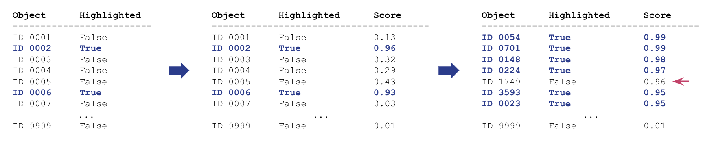

# Predicting Popularity and Importance of Artwork in the Met's Collection

In this project, I have predicted the popularity and importance of artwork in the collection of the Metropolitan Museum of Art, also known as The Met. The museum keeps a list of Highlights, which are selected works of art from The Met’s permanent collection that are considered popular and important. These are less than 1% of all artworks in their collection.

To find items closest to the Highlighted artworks, I created a classifier that finds Highlighted items with high precision, and then picked the top k highest scoring non-Highlighted items. Hopefully these are artworks that should have been Highlighted, but have somehow ‘slipped through the cracks’. In the image below, I’m creating a classifier, scoring, sorting by score and picking the highest scoring non-Highlighted items.

We have a needle in a haystack type problem, where the classes are heavily imbalanced, and we are only interested in precision at the very top of our list. Precision@k is the metric most suited for our problem, where we pick the k highest scoring items and measure the precision. For each model I have selected a different threshold that would result in exactly 100 positives, allowing me to compare them using Precision@k, where k is 100.

This type of modeling can be used by The Met to identify objects in their collection that they might consider reclassifying as important or for classifying new additions to the collection. At the end of this notebook I present the top 10 highest scoring non-highlighted objects.

For more details please see the [Notebook](https://github.com/SatenikS/predicting-artwork-importance-and-popularity/blob/main/Predicting-Artwork-Importance-and-Popularity.ipynb) or [HTML export](https://github.com/SatenikS/predicting-artwork-importance-and-popularity/blob/main/Predicting-Artwork-Importance-and-Popularity.html).
